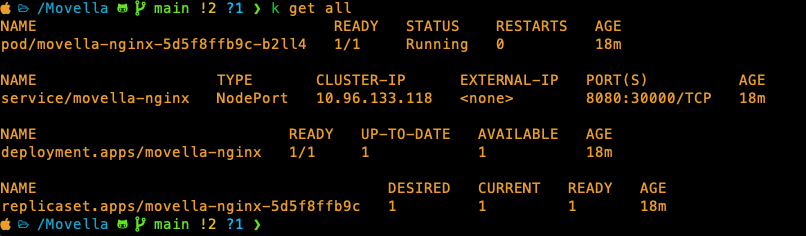
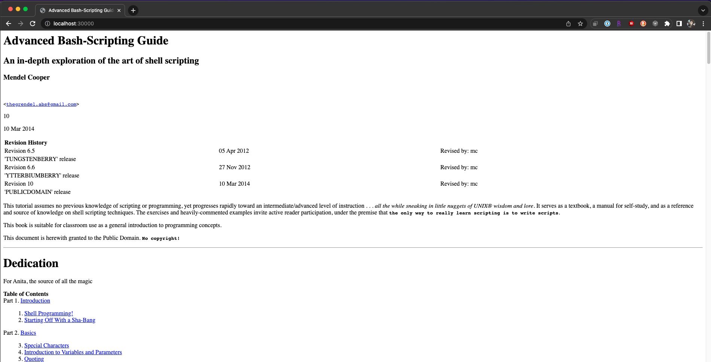

# Container Build
In `/build`, simply execute `docker build -t movella-nginx:alpine-slim .`

This is a very simple build - not much needs to happen.  I have chosen `alpine-slim` as it is *extremely* lightweight and the `.html` files supplied were simple. (Not that this is a bad thing)

Notice that entrypoints were not added to the DockerFile as the entrypoints supplied from the original nginx container source is sufficient enough to get the webserver up and running.

# Kubernetes
I am using Docker Desktop and the built-in Kubernetes engine (`1.25.2`) for the purposes of this demonstration.

### Deployment
Include liveliness probes to ensure the tcp socket is operational and a readiness probe to ensure the `index.html` in reachable and returns a `200` return code.

### Service
Quick and clean.  This will attach itself to the Deployment, target the `containerPort` that we defined in the `Deployment` as `nginx` and assign this Service a port of `8080`.
Since we are running Kubernetes locally, we are using `serviceType: NodePort` to poke holes in our local kubernetes deployment.  This will allow us to access the service in our browser using `localhost`.  

Typically, in a proper, full production kubernetes deployment we would have a Load Balancer managed by a cloud provider, and a reverse proxy, like `ingress-nginx` which will handle TLS termination along with hostname matching via an `Ingress`. In a situation like this, we would have set the serviceType to `ClusterIP` and allow the reverse proxy to handle translation within the clusters network.

### Kustomize
Apply the whole configuration with kustomize to keep things easy:
`kubectl apply -k .`
Keep in mind this will *also* create a namespace `nginx`

### Test
Go to: http://localhost:30000





# Script

> Please Ensure you have have `kubernetes` python package installed:
> `pip install kubernetes` 

Before running this script, please adjust any variables in the `KubernetesDefaults` class that may pertain to your particular kubernetes environment.

This is a pretty simple script.  It will:
 
1.
    * Load a custom kubernetes object with all pertinent information needed to access the kubernetes api
    * Load a kubernetes configuration
    * Load the kubernetes API client in the custom kubrenetes object
2. Run a `while` loop which runs every 300 seconds
    * grab a list of all running pods in the namespace `nginx`
    * Iterate through all availble pods and read through their logs using the function `readLogs`. Each loop returns a list of errors that were returned from every pod running:
        * Everytime this function (`readLogs`) is called, it is filtering for the pods logs within the last 5 mins (as this is how often the main function is called)
        * nginx's error logs are different than it's access logs.  So we filter by doing a simple regular expression search. The task I was given was to look only for *errors* so I allowed myself to get specific with my search pattern: `(\d{4}/\d{2}/\d{2} \d{2}:\d{2}:\d{2}) \[error\] (.*)`
        * Look through every line in the captured logs and if the regular expressions match, add them to a list and return it's value
    * If there were error logs that were captured, run through the `logIt` function:
        * All errors are a list of lines from all running pods.  To make things more human readable, lets chop these error lines up using regular expressions and put them together in a more digestible format: (JSON)
        * I may have gone a bit overboard here. Some digging on the internet has shown me consistent behaviour in how error logs are written from nginx, so the following regex should work in a fairly homogenous manner.  I would have most likely gone with Grok over regex, however I did not want to add any additional packages needed to run this script.
        The following pattern includes named groups which makes for object handling in python simpler:
            `(?P<dateTime>\d{4}/\d{2}/\d{2} \d{2}:\d{2}:\d{2})\s+\[(?P<severity>\w+)\]\s+(?P<pid>\d{1,2})#(?P<tid>\d{1,2}):.+\*(?P<connid>\d{1,4})\s(?P<message>.+),\sclient:\s(?P<client>.+),\sserver:\s(?P<server>.+),\srequest:\s(?P<request>.+),\shost:\s(?P<host>.+),\sreferrer:\s(?P<referrer>.+)`
        * Once a match is established, build out a dictionary and print it out as json.
        * If pretty printed, it becomes *much* easier to read:
            ```
            '2023/03/01 00:44:24 [error] 31#31: *8 open() "/usr/share/nginx/html/images/note.gif" failed (2: No such file or directory), client: 192.168.65.3, server: localhost, request: "GET /images/note.gif HTTP/1.1", host: "localhost:30000", referrer: "http://localhost:30000/parameter-substitution.html"'

            becomes:
            
            {
            "dateTime": "2023/03/01 00:44:24",
            "severity": "error",
            "processID": "31",
            "threadID": "31",
            "connectionID": "8",
            "client": "192.168.65.3",
            "server": "localhost",
            "request": "GET /images/note.gif HTTP/1.1",
            "host": "localhost:30000",
            "referrer": "http://localhost:30000/parameter-substitution.html",
            "message": "open() \"/usr/share/nginx/html/images/note.gif\" failed (2: No such file or directory)"
            }
            ```
        * Formatting like this would be very useful for additional monitoring services like logstash.  It will create better visualization for administrators, and enable operators to work with this data more constructively.